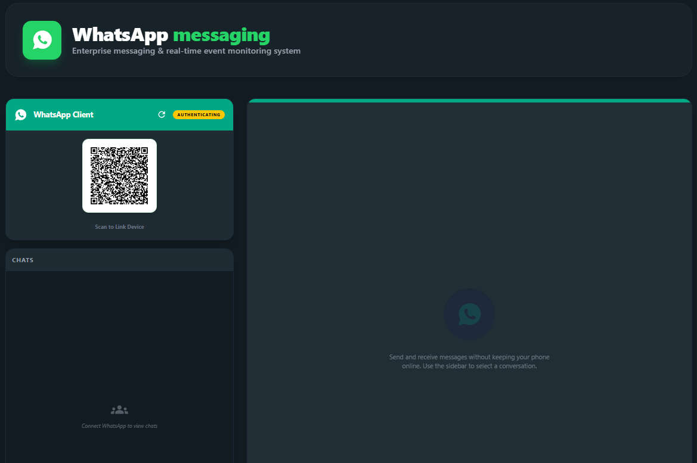

# Messaging Integration Backend Server

This is the backend service for a real-time messaging platform, currently integrating **WhatsApp Web** capabilities via a headless browser. It provides REST APIs for session management (QR code authentication) and fetching chats/messages, along with **Socket.IO** for real-time message synchronization.

Built with **Node.js, Express, TypeScript, Socket.IO, and whatsapp-web.js (Puppeteer)**.

---



## Features

- **WhatsApp Web Integration**: Scan QR code to link your WhatsApp account.
- **REST APIs**: Endpoints to get connection status, fetch chat lists, send messages, and logout.
- **Real-Time Sync**: Socket.IO integration to push incoming and outgoing messages instantly to the frontend.
- **Connection Stability**: Auto-reconnection logic and optimized Puppeteer settings for Windows/Linux environments.
- **Multi-device Session Storage**: Saves authentication sessions locally (`.wwebjs_auth`) so you don't have to scan the QR code every time you restart the server.

---

## Postman documentation
- **documentation**: https://documenter.getpostman.com/view/34968572/2sBXiesZeJ
## Frontend Client

This backend API is designed to work seamlessly with its Next.js frontend counterpart.

- **Frontend Repository**: [https://github.com/forhadislamse/messaging_frontend_server](https://github.com/forhadislamse/messaging_frontend_server)
- **Running Locally**: [http://localhost:3000/whatsapp](http://localhost:3000/whatsapp)

---

##  Local Setup Instructions

Follow these steps to get the backend running on your local machine.

### 1. Prerequisites

- **Node.js** (v18 or higher recommended)
- **npm** or **yarn**
- **Git**

### 2. Clone the Repository

```bash
git clone https://github.com/forhadislamse/messaging_backend_server.git
cd messaging_backend_server
```

### 3. Install Dependencies

Install all required NPM packages:

```bash
npm install
```

### 4. Environment Variables Setup

Create a `.env` file in the root directory by copying the `.env.example` file (or create a new one). Below is the comprehensive list of environment variables used in this project:

#### Core & Database (Required)
| Variable | Description | Default / Example |
|---|---|---|
| `NODE_ENV` | Application environment state | `development` or `production` |
| `PORT` | The port your server will run on | `13077` |
| `DATABASE_URL` | MongoDB connection string | `mongodb+srv://...` |
| `BCRYPT_SALT_ROUNDS` | Salt rounds for password hashing | `12` |

####  Authentication (Required)
| Variable | Description | Default / Example |
|---|---|---|
| `JWT_SECRET` | Secret key for signing access tokens | `your_super_secret_key` |
| `EXPIRES_IN` | Access token expiration time | `365d` |
| `REFRESH_TOKEN_SECRET` | Secret key for signing refresh tokens | `your_refresh_secret` |
| `REFRESH_TOKEN_EXPIRES_IN` | Refresh token expiration time | `365d` |

####  URLs & Client Connectors
| Variable | Description | Default / Example |
|---|---|---|
| `FRONTEND_BASE_URL` | Location of your frontend application | `http://localhost:3000` |
| `CLIENT_URL` | Client URL (used for CORS) | `http://localhost:3000` |
| `WHATSAPP_SESSION_PATH` | Directory to store WhatsApp login session | `.wwebjs_auth` |
 

**Quick Start Copy:**
```env
NODE_ENV=development
PORT=13077
DATABASE_URL=mongodb://localhost:27017/messaging
JWT_SECRET=myjwtsecret123
EXPIRES_IN=30d
WHATSAPP_SESSION_PATH=.wwebjs_auth
```

### 5. Running the Application

You can start the server in development mode with live reloading:

```bash
npm run dev
```

If the server starts successfully, you should see logs similar to:
```text
Server is listening on port  http://localhost:13077/api/v1
Socket.IO server running
WhatsApp Service initializing...
[WhatsApp] Need to scan QR code
```

### 6. Linking WhatsApp

Once the server is running, it will generate a QR code. 
- You can access the QR code via the status API endpoint (`GET /api/v1/whatsapp/status`).
- Alternatively, connect your frontend Next.js application to view the QR code visually.
- Open the WhatsApp app on your phone -> Settings -> Linked Devices -> Link a Device, and scan the QR code.
- Once authenticated, the server will log `[WhatsApp] Client is ready!` and you can start fetching chats.

---

## Postman API Documentation

Once the server is running (`http://localhost:13077`), you can test the following API endpoints. All WhatsApp routes are prefixed with `/api/v1/whatsapp`.

| Method | Endpoint | Description | Test Case / Payload Example |
|---|---|---|---|
| **GET** | `/status` | Check connection & get QR | **Success**: `{"success": true, "data": {"status": "READY"}}` |
| **GET** | `/chats` | Get all active chats | **Check**: Returns array of chats with last message info. |
| **GET** | `/chats/:id/messages` | Get message history | **Check**: Returns 40 messages for the given chat ID. |
| **POST** | `/send-message` | Send a text message | `{ "phoneNumber": "8801...", "message": "Hello!" }` |
| **POST** | `/logout` | Disconnect session | **Check**: Returns `{"success": true}` & clears local cache. |

---

## Socket.IO Testing Guide

- **URL**: `http://localhost:13077`
- **Step-by-Step Test**:
  1. Open Postman -> **New** -> **Socket.IO**.
  2. Enter the URL: `http://localhost:13077`.
  3. **VERY IMPORTANT**: Before clicking Connect, go to the **Listeners** tab.
  4. In the "Add listener" field, type `whatsapp_status` and click **Add**.
  5. Type `whatsapp_message_received` and click **Add**.
  6. Now, go back and click **Connect**.
  7. You should immediately see the `whatsapp_status` event in the message log at the bottom.
  8. **To test messages**: Send a message to your WhatsApp number from another phone. You will see it pop up under the `whatsapp_message_received` listener.

- **Events to Emit (Send via Postman)**:
  - Go to the **Events** tab.
  - Event Name: `send_message`.
  - Message (JSON):
    ```json
    { "phoneNumber": "8801...", "message": "Hello from Postman!" }
    ```
  - Click **Send**.

---

---
*Created by [forhadislamse]*
